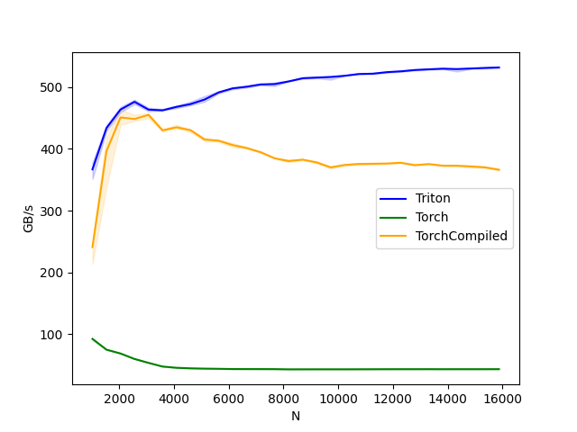

## Triton RMSNorm

Minimal fused RMSNorm forward/backward kernels written in Triton, with a
correctness check against PyTorch and a simple performance benchmark.

The derivation is row‑wise; extending to batches just means applying it independently to each row.

### Forward pass
For input $\mathbf{x} \in \mathbb{R}^{N}$, the normalized output $\mathbf{y} \in \mathbb{R}^{N}$ is defined as:
```math
\mathbf{y} = \hat{\mathbf{x}} \odot \mathbf{w}, \quad
  \text{where } \hat{\mathbf{x}} = r \mathbf{x} = \frac{\mathbf{x}}{RMS(\mathbf{x})}, \quad
  RMS(\mathbf{x}) = \sqrt{\frac{1}{N} \sum_{i=1}^{N} x_i^2 + \epsilon}, \quad
  r = \frac{1}{RMS(\mathbf{x})}
```

### Backward pass
Given upstream gradient $\frac{dL}{d\mathbf{y}} =: d\mathbf{y}$.

#### Grad w.r.t. $\mathbf{w}$:
```math
\frac{\partial L}{\partial \mathbf{w}} = d\mathbf{y} \odot \hat{\mathbf{x}}.
```

#### Grad w.r.t. $\hat{\mathbf{x}}$:
```math
\frac{\partial L}{\partial \hat{\mathbf{x}}} = d\mathbf{y} \odot \mathbf{w} \coloneqq \mathbf{g}.
```

#### Grad w.r.t. $\mathbf{x}$:

Scalar $r$ derivative:
```math
\nabla_{\mathbf{x}} RMS(\mathbf{x}) = \frac{\mathbf{x}}{N\, RMS(\mathbf{x})}
\;\Rightarrow\;
\nabla_{\mathbf{x}} r = - \frac{\mathbf{x}}{N\, RMS(\mathbf{x})^3} = - \frac{r^3}{N}\, \mathbf{x}.
```

Differential of $\hat{\mathbf{x}}$:
```math
d\hat{\mathbf{x}} = r\, d\mathbf{x} + \mathbf{x}\, dr.
```

Use $dL = \mathbf{g}^{\top} d\hat{\mathbf{x}} = r\, \mathbf{g}^{\top} d\mathbf{x} + (\mathbf{g}^{\top} \mathbf{x})\, dr$ with $dr = (\nabla_{\mathbf{x}} r)^{\top} d\mathbf{x}$:
```math
dL = \left[ r\, \mathbf{g}^{\top} - \frac{r^3}{N} (\mathbf{g}^{\top} \mathbf{x}) \mathbf{x}^{\top} \right] d\mathbf{x}
\;\Rightarrow\;
\frac{\partial L}{\partial \mathbf{x}} = r\, \mathbf{g} - \frac{r^3}{N} \mathbf{x}\, (\mathbf{g}^{\top} \mathbf{x}).
```

### Setup
```bash
pip install torch triton matplotlib
```

### Run
```bash
python rms-norm.py
```
This will:
- run a quick correctness test;
- benchmark the backward pass for Triton vs Torch vs TorchCompiled;
- write outputs next to the script:
  - `rms-norm-backward.png`
  - `rms-norm-backward.csv`

### Benchmark

